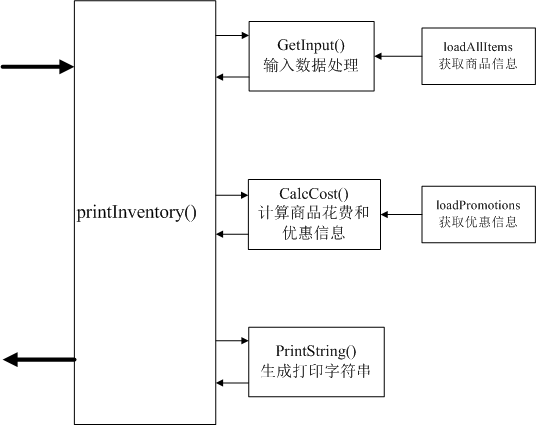

### POS系统程序结构分析

分析任务的需求，可以发现该任务可以分为3大块来处理：

1. 输入信息处理
2. 商品结算
3. 输出字符串整合

#### 程序的管道图如下：



1. 输入信息处理过程通过输入的字符矩阵以及loadAllItems获取输入商品的条码，名称，单位，价格等信息，对重复商品做数量累加，输出上述信息的JSON格式。
2. 商品结算阶段通过loadPromotions获取所有商品的折扣，计算折后商品的名称，数量，并计算小计信息。
3. 根据所买商品的信息及折扣信息输出格式化的字符串。

#### 任务分解

```javascript
#GetInput()输入数据处理
输入：
	Inputs；Array
    ItemsInfo[{
    	barcode: String,
   		name: String,
        unit:String,
    	price: Number
  }]
输出：
	ItemJson[{
    	barcode: String,
   		name: String,
        unit:String,
        num:Number,
    	price: Number,
        total:Number
	}]
#CalcCost()商品结算
输入：
	ItemJson[{
    	barcode: String,
   		name: String,
        unit:String,
        num:Number,
    	price: Number,
        total:Number
	}]
	Promotions[{
    	type: String,
    	barcodes: Array
  	}]
输出：
	CostJson[{
    	name:String,
        price:Number,
        unit:Number
        num:Number
	}]
#PrintString()输出字符串整合
输入：
	ItemJson[{
    	barcode: String,
   		name: String,
        unit:String,
        num:Number,
    	price: Number,
        total:Number
	}]
	CostJson[{
    	name:String,
        price:Number,
        unit:Number
        num:Number
	}]
输出：ResultString：String
```
以下为原内容
------------------------------------------------------------------------------------------------------------------------

# POS Project v1

POS收银机 版本：v1

## 教学目标

1. 熟悉JavaScript的基本语法；
2. 熟悉JavaScript的基本逻辑语句及关键字；

## 需求描述

商店里进行购物结算时会使用收银机（POS）系统，这台收银机会在结算时根据客户的购物车（Cart）中的商品（Item）和商店正在进行的优惠活动（Promotion）进行结算和打印购物清单。

已知该商店正在对部分商品进行“买二赠一”的优惠活动。

我们需要实现一个名为```printInventory```函数，该函数能够将指定格式的数据作为参数输入，然后在浏览器的控制台中输出结算清单的文本。

输入格式（样例）：

```javascript
[
    'ITEM000001',
    'ITEM000001',
    'ITEM000001',
    'ITEM000001',
    'ITEM000001',
    'ITEM000003-2',
    'ITEM000005',
    'ITEM000005',
    'ITEM000005'
]
```
其中对'ITEM000003-2'来说,"-"之前的是标准的条形码,"-"之后的是数量。
当我们购买需要称量的物品的时候,由称量的机器生成此类条形码,收银机负责识别生成小票。


清单内容（样例）：

```
***<没钱赚商店>购物清单***
名称：可口可乐，数量：3瓶，单价：3.00(元)，小计：6.00(元)
名称：羽毛球，数量：5个，单价：1.00(元)，小计：4.00(元)
名称：苹果，数量：2斤，单价：5.50(元)，小计：11.00(元)
----------------------
挥泪赠送商品：
名称：可口可乐，数量：1瓶
名称：羽毛球，数量：1个
----------------------
总计：21.00(元)
节省：4.00(元)
**********************
```

## 作业要求

1. 根据```spec/main-spec.js```中的测试用例，在```src/main.js```文件中编写实现代码并确保测试通过；
2. 请在保证代码可读性的前提下，尽可能用最少的代码行数完成作业；
3. 请将完成后的作业提交到自己的GitHub仓库下；
4. 请保持良好的代码提交（Commit）习惯。

## 作业提示

1. 可使用```loadAllItems()```方法获取全部的商品，该方法返回结果为一个包含了商品对象的数组（样例）：

   ```
   [ item1, item2, item3, ..., itemN ]
   ```

2. 每一个商品对象的结构如下（样例）：

   ```javascript
   {
      barcode: 'ITEM000000',
      name: '可口可乐',
      unit: '瓶',
      price: 3.00
   }
   ```

3. 可使用```loadPromotions()```方法获取全部的促销信息，该方法返回结果为一个包含有促销信息对象的数组（样例）：

   ```javascript
   [
      {
        type: 'BUY_TWO_GET_ONE_FREE',
        barcodes: [
          'ITEM000000',
          'ITEM000001'
        ]
      },
      {
        type: 'OTHER_PROMOTION',
        barcodes: [
          'ITEM000003',
          'ITEM000004'
        ]
      }
   ]
   ```

4. 应学习并善于使用各种流行浏览器所附带的开发人员工具中的控制台（Console）功能。


## 如何使用

首先初次下载完需要安装依赖：
```
  npm install
```

然后才能执行测试：

```
  npm test
```

可以通过测试来检测本地代码是否完成作业要求，测试通过即可提交到github，把git库地址填到答题页面，并提交表单。

